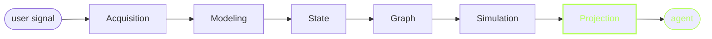
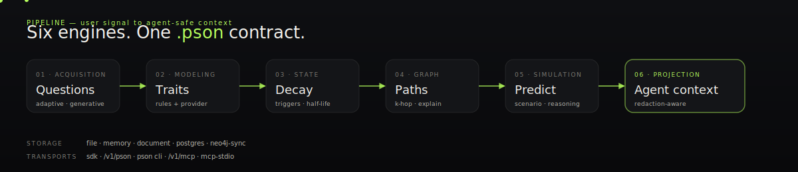
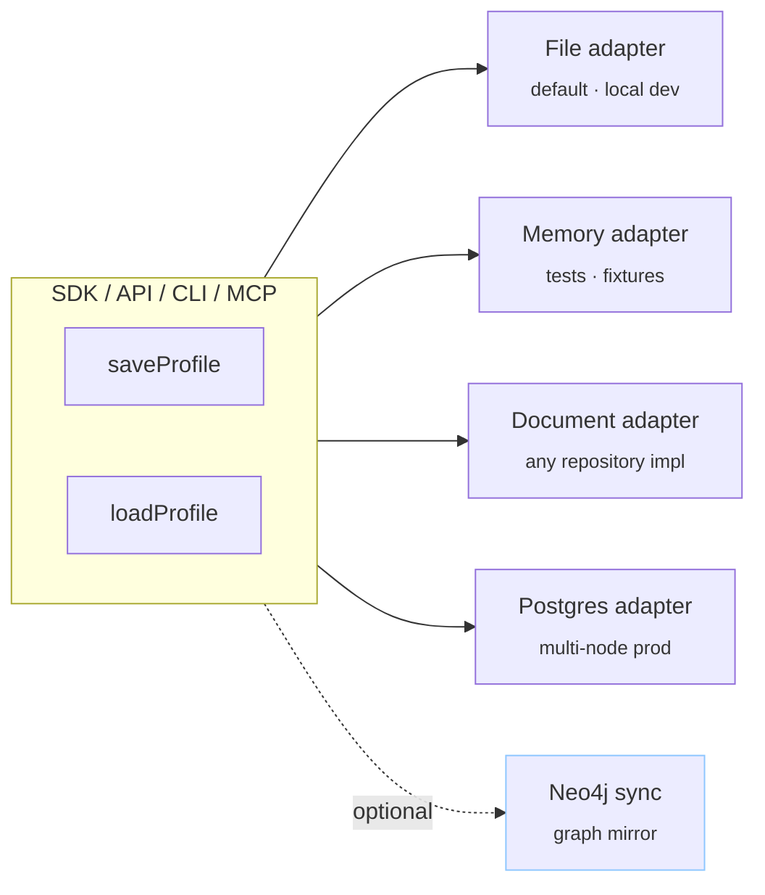

<!-- PSON5 — personalization your agents can actually reason about. -->

<p align="center">
  
</p>

<p align="center">
  <a href="https://github.com/fredabila/pson5/actions"></a>
  <a href="https://github.com/fredabila/pson5/blob/main/LICENSE"></a>
  <a href="https://github.com/fredabila/pson5/blob/main/CHANGELOG.md"></a>
  
  
  
</p>

<p align="center">
  <strong>PSON5 is an open standard and infrastructure for <em>cognitive</em> user profiles.</strong><br/>
  It keeps what the user said, what the model inferred, and what the simulator predicts as three separate things —<br/>
  so agents can plan, explain, and fail gracefully on top of them.
</p>

<p align="center">
  <a href="docs/usage/quickstart.md"><strong>Quickstart →</strong></a>  ·
  <a href="docs/api/api-contract.md">API contract</a>  ·
  <a href="docs/usage/provider-adapters.md">Provider adapters</a>  ·
  <a href="docs/usage/cli-reference.md">CLI reference</a>  ·
  <a href="examples/claude-driven-persona/">Live demo</a>
</p>

---

## Why PSON5

Most agent systems treat user memory as loosely structured notes. That's hard to validate, awkward to redact, dangerous to hand to another agent, and impossible to simulate from.

PSON5 fixes this by making the boundary between **observation**, **inference**, and **simulation** a first-class, portable data contract.



Six engines, one `.pson` contract, four transports:

<p align="center">
  
</p>

## The three-layer contract

<table>
  <thead>
    <tr>
      <th align="left">Layer</th>
      <th align="left">What it holds</th>
      <th align="left">Certainty</th>
      <th align="left">Written by</th>
    </tr>
  </thead>
  <tbody>
    <tr>
      <td><strong><span style="color:#f5c76a">observed</span></strong></td>
      <td>Direct user statements and normalized answers</td>
      <td>High</td>
      <td>Acquisition engine (the only writer)</td>
    </tr>
    <tr>
      <td><strong><span style="color:#b6ff5c">inferred</span></strong></td>
      <td>Traits, heuristics, states derived from evidence</td>
      <td>Confidence-scored · decays over time</td>
      <td>Modeling + state engines</td>
    </tr>
    <tr>
      <td><strong><span style="color:#8ec7ff">simulated</span></strong></td>
      <td>Scenario-specific predictions with reasoning</td>
      <td>Hypothesis, never fact</td>
      <td>Simulation engine</td>
    </tr>
  </tbody>
</table>

> **The hard rule.** Nothing in `simulated` ever becomes `observed`. Nothing `inferred` loses its confidence score. When you export a profile, the boundary travels with it.

## Quickstart

```bash
npm install @pson5/sdk
```

```ts
import { PsonClient } from "@pson5/sdk";

const pson = new PsonClient();
const profile = await pson.createAndSaveProfile({ user_id: "user_123" });

// Ask the next adaptive question
const next = await pson.getNextQuestions(profile.profile_id, { limit: 1 });

// Submit an answer — runs modeling → state → graph → save
await pson.learn({
  profile_id: profile.profile_id,
  session_id: next.session.session_id,
  answers: [{ question_id: next.questions[0].id, value: "delay_start" }]
});

// Get an agent-safe, relevance-ranked projection
const context = await pson.getAgentContext(profile.profile_id, {
  intent: "help the user plan a deadline-sensitive task",
  include_predictions: true,
  max_items: 6
});
```

That's it. No provider required. [Full quickstart →](docs/usage/quickstart.md)

## Zero-registry flow — Claude invents every question

You don't have to write any questions. Hand PSON5 a one-paragraph domain brief and a live model takes over.

```ts
import { deriveGenerativeQuestions } from "@pson5/provider-engine";
import { openGenerativeSession, appendGeneratedQuestions, submitLearningAnswers } from "@pson5/acquisition-engine";

const session = await openGenerativeSession(profile.profile_id, { depth: "deep" });

const { questions } = await deriveGenerativeQuestions({
  profile,
  brief: {
    id: "tech-talent-intelligence",
    title: "Tech talent — recruiting / employment",
    description: "Understand how this engineer works, what they want, where they thrive.",
    target_areas: ["tech_stack", "career_trajectory", "compensation", "work_style", "values"]
  },
  strategy: "broad_scan",
  question_count: 1,
  session_state: { /* ...current profile state... */ }
});

await appendGeneratedQuestions(session.session_id, questions);
// show questions[0].prompt to the user, submit their answer, loop.
```

The engine decides when to stop, interleaves broad-scan / depth-focus / contradiction-probe strategies, and never repeats itself. **See the [Josh demo](examples/claude-driven-persona/)** for an end-to-end run where both the questions and the user's answers come from Claude.

## Model-agnostic providers

One interface, any model. Three built-in adapters cover most deployments; `registerProviderAdapter(...)` lets you plug in anything else in under 20 lines.

<table>
  <thead>
    <tr>
      <th align="left">Adapter</th>
      <th align="left">Transport</th>
      <th align="left">Works with</th>
    </tr>
  </thead>
  <tbody>
    <tr>
      <td><code>openai</code></td>
      <td>Responses API · JSON-schema</td>
      <td>OpenAI (GPT-4.1, GPT-4o, …)</td>
    </tr>
    <tr>
      <td><code>anthropic</code></td>
      <td>Messages API</td>
      <td>Anthropic (Claude Sonnet / Haiku / Opus)</td>
    </tr>
    <tr>
      <td><code>openai-compatible</code></td>
      <td>Chat completions · JSON mode</td>
      <td>Ollama · vLLM · LiteLLM · OpenRouter · Groq · Together · Fireworks · Azure OpenAI · …</td>
    </tr>
  </tbody>
</table>

```bash
# OpenAI
export PSON_AI_PROVIDER=openai PSON_AI_MODEL=gpt-4.1-mini OPENAI_API_KEY=sk-...

# Claude
export PSON_AI_PROVIDER=anthropic PSON_AI_MODEL=claude-haiku-4-5-20251001 ANTHROPIC_API_KEY=sk-ant-...

# Ollama (no key)
export PSON_AI_PROVIDER=openai-compatible PSON_AI_BASE_URL=http://localhost:11434/v1 PSON_AI_MODEL=llama3.1
```

[Provider adapter guide →](docs/usage/provider-adapters.md)

## Four transports, same executor

<table>
  <thead>
    <tr><th align="left">Transport</th><th align="left">Best for</th><th align="left">One-liner</th></tr>
  </thead>
  <tbody>
    <tr>
      <td><strong>SDK</strong></td>
      <td>Same process as your agent</td>
      <td><code>import { PsonClient } from "@pson5/sdk"</code></td>
    </tr>
    <tr>
      <td><strong>HTTP API</strong></td>
      <td>Remote agents, other runtimes</td>
      <td><code>POST /v1/pson/agent-context</code></td>
    </tr>
    <tr>
      <td><strong>CLI</strong></td>
      <td>Local workflows, CI scripting</td>
      <td><code>pson agent-context &lt;id&gt; --intent "…" --json</code></td>
    </tr>
    <tr>
      <td><strong>MCP</strong></td>
      <td>Agent frameworks (stdio or HTTP JSON-RPC)</td>
      <td><code>pson mcp-stdio --store .pson5-store</code></td>
    </tr>
  </tbody>
</table>

Per-tool role + scope policies, subject-user binding, tenant isolation, and request-id audit all run under every transport.

## Storage that scales from local to cloud



Every adapter passes the same `tests/integration/storage-adapter-contract.mjs` suite. [Serialization engine →](docs/usage/serialization-engine.md)

## Privacy is a first-class layer

- **Consent gates every read path.** When `profile.consent.granted === false`, the agent-context layer returns an empty payload with a single `consent_not_granted` redaction note.
- **`privacy.restricted_fields` travels with the profile.** Sanitization before provider calls, safe-redaction on export, and filtered agent-context projections all honour it.
- **Provider policy produces reason codes.** Not a boolean — callers always know *why* augmentation was denied.
- **Audit is jsonl-structured.** Request IDs, redaction decisions, retries, token estimates — all machine-readable.

[Privacy model →](docs/privacy/privacy-model.md)

## Agent integration

PSON5 ships with a ready-to-load skill for Claude-style agents (`skills/pson-agent/SKILL.md`), a typed tool contract (`getPsonAgentToolDefinitions()` from the SDK), and MCP transports for any framework. The hard rules are enforced regardless of transport:

- Agents consume `pson_get_agent_context`, not the raw profile.
- Agents respect `stop_reason`, `fatigue_score`, `confidence_gaps`, and `contradiction_flags`.
- Agents treat `simulated` outputs as probabilistic support — never truth.
- Restricted fields never round-trip into prompts.

[Agent tools →](docs/usage/agent-tools.md) · [PSON agent skill →](docs/usage/pson-agent-skill.md)

## Live examples

| Example | What it shows | Where |
| --- | --- | --- |
| **Josh tech-employment** | Hand-registered domain module, adaptive learning with Claude rewriting each question | [`examples/josh-tech-persona/`](examples/josh-tech-persona/) |
| **Claude-driven persona** | **Zero-registry flow.** Domain brief → Claude invents every question → Josh-simulator answers → full profile with 31-node graph, 3 agent contexts, 3 simulations, exportable HTML viewer and Cypher | [`examples/claude-driven-persona/`](examples/claude-driven-persona/) |
| Education / Productivity | Hand-authored domain modules with simple scripts | [`examples/education/`](examples/education/) · [`examples/productivity/`](examples/productivity/) |
| Agent-tool transports | Using PSON5 from OpenAI function tools, MCP-over-HTTP, MCP-stdio, and direct SDK | [`examples/agent-tools/`](examples/agent-tools/) |

## Repository layout

```
pson5/
├── apps/
│   ├── api/          — HTTP API (auth, audit, agent-tool transports)
│   ├── cli/          — pson command + Ink console + MCP stdio
│   ├── web/          — landing + console + access gate
│   └── docs-site/    — the documentation site
├── packages/
│   ├── core-types/           — shared TypeScript interfaces
│   ├── schemas/              — Zod validator for .pson documents
│   ├── privacy/              — consent, policy, redaction
│   ├── acquisition-engine/   — questions, sessions, generative flow
│   ├── modeling-engine/      — traits, heuristics, AI promotion
│   ├── state-engine/         — time decay + trigger evaluation
│   ├── graph-engine/         — k-hop traversal + path-based explain
│   ├── simulation-engine/    — scenario prediction
│   ├── agent-context/        — projection with redaction notes
│   ├── provider-engine/      — adapter registry + OpenAI / Anthropic / openai-compatible
│   ├── serialization-engine/ — lifecycle + adapters + revision audit
│   ├── neo4j-store/          — optional graph mirror
│   ├── postgres-store/       — cloud-grade adapter
│   └── sdk/                  — PsonClient + tool executor
├── skills/pson-agent/        — Claude skill for agent use
├── examples/                 — end-to-end demos
├── docs/                     — markdown reference (consumed by docs-site)
├── scripts/                  — Neo4j setup + sync helpers
└── tests/integration/        — shared contract + core-flow tests
```

## Run the demos

### Quickstart (no model required)

```bash
npm install && npm run build
node -e 'import("./packages/sdk/dist/sdk/src/index.js").then(async ({ PsonClient }) => {
  const c = new PsonClient();
  const p = await c.createAndSaveProfile({ user_id: "demo" }, { rootDir: ".pson5-store" });
  console.log(p.profile_id);
})'
```

### Claude-driven persona (full richness)

```bash
export ANTHROPIC_API_KEY=sk-ant-...
export PSON_AI_PROVIDER=anthropic
export PSON_AI_MODEL=claude-haiku-4-5-20251001
node examples/claude-driven-persona/run.mjs
# output/graph.html — open in a browser
# output/graph.cypher — paste into Neo4j Browser
```

### Open the landing page

```bash
npm run dev:api                          # :3015
npm run dev --workspace @pson5/web       # :4173 — dark-editorial landing
```

For the interactive operational UI, use the terminal: `pson console` (Ink/React TUI) or `npx @pson5/cli console` if you haven't installed globally.

## Neo4j

The knowledge graph lives inside every `.pson` profile. Neo4j is an optional mirror for cross-profile queries and visual exploration. [One-command setup →](docs/usage/neo4j-setup.md)

## Feature matrix

<table>
  <thead>
    <tr>
      <th align="left">Surface</th>
      <th align="center">Observed writeback</th>
      <th align="center">Inferred traits</th>
      <th align="center">State decay</th>
      <th align="center">Graph traversal</th>
      <th align="center">Simulation</th>
      <th align="center">Agent context</th>
      <th align="center">Audit</th>
    </tr>
  </thead>
  <tbody>
    <tr>
      <td>SDK</td>
      <td align="center">✓</td><td align="center">✓</td><td align="center">✓</td>
      <td align="center">✓</td><td align="center">✓</td><td align="center">✓</td><td align="center">✓</td>
    </tr>
    <tr>
      <td>HTTP API</td>
      <td align="center">✓</td><td align="center">✓</td><td align="center">✓</td>
      <td align="center">✓</td><td align="center">✓</td><td align="center">✓</td><td align="center">✓</td>
    </tr>
    <tr>
      <td>CLI</td>
      <td align="center">✓</td><td align="center">✓</td><td align="center">✓</td>
      <td align="center">✓</td><td align="center">✓</td><td align="center">✓</td><td align="center">✓</td>
    </tr>
    <tr>
      <td>MCP (HTTP + stdio)</td>
      <td align="center">✓</td><td align="center">✓</td><td align="center">—</td>
      <td align="center">—</td><td align="center">✓</td><td align="center">✓</td><td align="center">✓</td>
    </tr>
  </tbody>
</table>

## Who it's for

- **Agent infra teams** — structured, portable memory that beats JSON blobs on prompt length, safety, and debuggability.
- **Consumer product teams** — preference capture that doesn't silo per feature.
- **Tutor / coach / recruiter agents** — domain briefs let a model collect rich signal without shipping 40 hand-written questions.
- **Privacy-first applications** — consent-first, policy-gated, export-portable by construction.

## Contributing

Issues, discussions, PRs all welcome. See [CONTRIBUTING.md](CONTRIBUTING.md) and [CODE_OF_CONDUCT.md](CODE_OF_CONDUCT.md). Security reports go through [SECURITY.md](SECURITY.md).

## License

[MIT](LICENSE). Built in the open.

---

<p align="center">
  <sub>PSON<span style="font-style:italic">5</span> · v0.2.0 · the hard rule is always <em>observed ≠ inferred ≠ simulated</em></sub>
</p>
